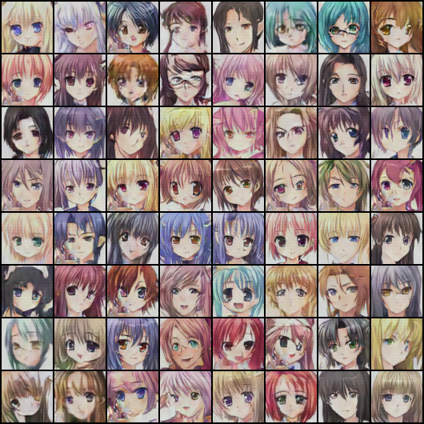

# Anime-GANs

Anime-GANs is a project that uses Generative Adversarial Networks (GANs) to generate anime faces. The project is implemented in Python using the PyTorch library.



## Dataset

The dataset used for training the GANs can be found [here](https://www.kaggle.com/datasets/splcher/animefacedataset).

## Description

The project consists of two main components: the Generator and the Discriminator. The Generator generates new anime faces from a latent space, while the Discriminator tries to distinguish between real and generated faces.

The training process continues for 300 epochs. The image above shows the generated anime faces after 150 epochs. The training was normal up to this point, but the generations in later epochs started getting progressively weird. This could be due to the model beginning to overfit to the training data, or the generator and discriminator getting out of sync, a common issue in GAN training known as "mode collapse".

## Code

The code for the project is structured as follows:

- Import necessary libraries and set up parameters
- Define data transformation and load the dataset
- Define the Generator and Discriminator classes
- Initialize the Generator and Discriminator, and set up the optimizers and loss function
- Train the Generator and Discriminator
- Save the generated images and the model

## Usage

To run the script, simply execute the following command:

```bash
python animegans.py
```
This will start the training process. The generated images will be saved in the `/output` directory, and the model will be saved in the `/model` directory.

## Requirements

- Python 3.6 or later
- PyTorch 1.0 or later
- torchvision 0.2.2 or later
- NumPy 1.15.4 or later
